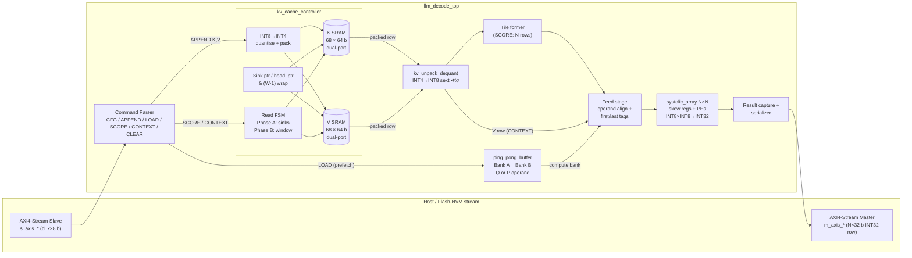

# 01 — System Architecture: Edge LLM Decode Core

> **Scope.** This document establishes the mathematical and architectural foundation of the
> Edge LLM Decode Core: what it computes, why the decode phase is limited by memory rather than
> arithmetic, and how the two memory-side techniques implemented in RTL — **Attention Sinks with a
> Sliding Window** and **Sub-Byte INT4 KV packing** — attack that limit. Every number and bit
> layout here is the one implemented in `rtl/` and modelled bit-exactly in `tb/golden_model.py`.

---

## 1. Default Configuration

| Parameter      | Symbol | Default | Meaning                                                        |
|----------------|--------|---------|----------------------------------------------------------------|
| `N`            | N      | 4       | Systolic array is N × N PEs (scalable to 8 × 8)                |
| `HEAD_DIM`     | d_k    | 16      | Key/value head dimension (must be a multiple of N, even)       |
| `SINK_COUNT`   | S_s    | 4       | Pinned attention-sink tokens                                   |
| `WINDOW_SIZE`  | W      | 64      | Sliding-window capacity (power of two)                         |
| `BUF_DEPTH`    | —      | 128     | Words per ping-pong bank (≥ max(d_k, S_s + W))                 |
| Data types     | —      | INT8 in, INT4 stored, INT32 accumulate                          |

The maximum attended context is therefore `S_max = S_s + W = 68` tokens, regardless of how many
tokens have been decoded. The cache has a fixed size, so decoding can run forever.

---

## 2. Mathematical Foundation: Single-Query Attention

### 2.1 Prefill vs. decode

For one attention head with head dimension `d_k`, full (prefill) attention over `S` tokens is

$$
\mathrm{Attn}(Q,K,V) = \mathrm{softmax}\!\left(\frac{QK^\top}{\sqrt{d_k}}\right)V,\qquad
Q,K,V \in \mathbb{R}^{S\times d_k}.
$$

During **auto-regressive decode**, token `t` produces exactly one new query. Only the new
token's key/value rows are appended, and every earlier row is re-read from the **KV cache**:

$$
q_t \in \mathbb{R}^{1\times d_k},\qquad K_{\le t},V_{\le t}\in\mathbb{R}^{S\times d_k}
$$

$$
s_t = \frac{q_t K_{\le t}^\top}{\sqrt{d_k}} \in \mathbb{R}^{1\times S},\qquad
p_t = \mathrm{softmax}(s_t),\qquad
o_t = p_t V_{\le t} \in \mathbb{R}^{1\times d_k}.
$$

Both products are **matrix–vector (GEMV)** operations. They are the workload this core accelerates.

### 2.2 Mapping GEMV onto an N × N array with grouped-query attention

A single query vector occupies only one column of a 2-D array (1/N utilisation). Modern edge
LLMs (Llama-3, Mistral, Qwen-2, Gemma) use **Grouped-Query Attention (GQA)**, where `G` query
heads share one KV head. The core maps the `N` query heads of one GQA group onto the `N` array
columns, so a single pass over the KV cache serves all of them:

| Opcode     | Array computes (INT32 accumulation)                                  | Rows (i)   | Cols (j)   | Reduction  |
|------------|----------------------------------------------------------------------|------------|------------|------------|
| `SCORE`    | $S[\tau][h] = \sum_{d} K[\tau][d]\cdot Q[h][d]$                      | N tokens τ | N heads h  | d_k        |
| `CONTEXT`  | $O[h][c] = \sum_{\tau} P[h][\tau]\cdot V[\tau][c]$                   | N heads h  | N dims c   | S (tokens) |

The division by √d_k and the softmax are applied outside the array. They are scalar, low-bandwidth,
non-linear operations that belong in a host CPU or a small vector unit. `P` is fed back as INT8
probabilities. Doing the non-linear step outside keeps the array a pure, bit-exact integer
GEMM engine.

Tiling:
* **SCORE:** the `S` cached tokens are split into `⌈S/N⌉` tiles of N tokens. Each tile streams `d_k`
  beats through the array. A partial final tile is zero-padded, and its padded rows are not emitted.
* **CONTEXT:** the `d_k` output dimensions are split into `d_k/N` passes. Each pass streams all
  `S` value rows through the array, so every PE reduces over the whole context.

---

## 3. The Memory Wall: Why Decode Is Bandwidth-Bound

### 3.1 Arithmetic intensity

Arithmetic intensity is `I = (operations) / (bytes moved from memory)`. Count one MAC as 2 ops.

**Weight GEMV (projections / MLP).** For a layer `y = xW` with `W ∈ ℝ^{d_in × d_out}` and one token:

$$
\text{ops} = 2\,d_{in}d_{out},\qquad \text{bytes} \approx b_w\,d_{in}d_{out}
\;\;\Longrightarrow\;\; I_{\text{GEMV}} = \frac{2}{b_w}
$$

Here `b_w` is bytes per weight: `I = 2 ops/B` for INT8 and `4 ops/B` for INT4. The activation
vector is negligible. **Every weight is fetched once and used exactly once.** Prefill with `S_p`
prompt tokens reuses each weight `S_p` times, so `I_prefill = 2·S_p / b_w`. That is `S_p` times
higher, which is why prefill is compute-bound and decode is not.

**Attention over the KV cache.** For one KV head shared by `G` query heads, context length `S`, and
`b_kv` bytes per element:

$$
\text{ops} = \underbrace{2\,G\,S\,d_k}_{QK^\top} + \underbrace{2\,G\,S\,d_k}_{PV} = 4GSd_k,\qquad
\text{bytes} = 2\,S\,d_k\,b_{kv}
\;\;\Longrightarrow\;\; I_{\text{attn}} = \frac{2G}{b_{kv}}.
$$

Intensity is **independent of S**. A longer context adds bytes and ops in the same proportion. With
`G = 4` and INT8, `I = 8 ops/B`. With INT4, `I = 16 ops/B`.

### 3.2 Roofline

Attainable performance is `P = min(P_peak, I · BW)`. The ridge point `I* = P_peak / BW` separates the
two regimes. For representative edge platforms:

| Platform (illustrative)            | P_peak (INT8) | BW        | Ridge I*    | Decode I | Bound       |
|------------------------------------|---------------|-----------|-------------|----------|-------------|
| This core, 4×4 @ 200 MHz, on-chip  | 6.4 GOPS      | 3.2 GB/s¹ | 2.0 ops/B   | 8–16     | compute²    |
| This core, 8×8 @ 200 MHz, on-chip  | 25.6 GOPS     | 3.2 GB/s¹ | 8.0 ops/B   | 8–16     | balanced    |
| Mobile NPU + LPDDR4X-4266 ×32      | 4 TOPS        | 17 GB/s   | 235 ops/B   | 2–16     | **memory**  |
| Jetson-class SoC + LPDDR5 ×128     | 40 TOPS       | 102 GB/s  | 392 ops/B   | 2–16     | **memory**  |

¹ The core reads one packed KV row (`d_k/2` bytes = 8 B) per cycle: 8 B × 200 MHz = 1.6 GB/s per K or V
stream. The 200 MHz rows use the design *target* clock. The measured post-route Fmax on a low-cost
ECP5 is 132–147 MHz (4×4) and 117–125 MHz (8×8), which scales these rows proportionally (docs/04). The sizing lets on-chip SRAM keep the small array fed. ² The toy-sized array is deliberately
matched to its on-chip SRAM. The system argument concerns the *off-chip* term.

```
 log P (ops/s)
   ▲                         P_peak ────────────────────────────  (compute roof)
   │                        ╱
   │                      ╱ ▲
   │                    ╱   │  ≈ 15–100× headroom lost
   │   decode (I≈2–16)╱     │  because I << I*
   │        ●───────╱───────┘
   │              ╱  slope = BW (memory roof)
   │            ╱
   │          ╱                        prefill (I ≈ 2·S_p) ●  → compute-bound
   └────────┴───────────┴──────────────────────┴──────────────▶ log I (ops/byte)
            2          16                      I* ≈ 200–400
```

**Proposition (decode is memory-bound).** If `I_decode < I*`, the attainable throughput is
`I_decode · BW < P_peak`. Adding MAC units (raising `P_peak`) changes nothing. Only raising `BW` or
raising `I` (fewer bytes per op) helps. On every realistic edge platform, `I_decode ≤ 16 ≪ I* ≈ 200`.
∎

**Corollary (token rate).** A model with `M` weight bytes and a `C`-byte KV cache per token step
decodes at most `BW / (M + C)` tokens/s. Example: a 1 B-parameter model at INT4 has M = 0.5 GB.
On LPDDR4X at 17 GB/s this gives ≤ 34 tok/s even with infinite compute. The KV-cache term `C` grows
linearly with context and *eventually dominates*: Llama-3-8B at 32 k context holds a 4 GB KV cache
in FP16.

### 3.3 The two levers this core implements

The corollary leaves exactly two knobs on the memory side:

1. **Bound `C`** so the cache term stops growing with sequence length → **Attention Sinks + Sliding
   Window** (§4). `C` becomes `O(S_s + W)` instead of `O(t)`.
2. **Shrink bytes per element** → **INT4 packed KV** (§5). `b_kv` goes from 1 to ½, which doubles
   `I_attn` and halves `C`.

---

## 4. Attention Sinks & Sliding Window

### 4.1 Why a plain sliding window fails

A naive window keeps only the last `W` tokens. Empirically (Xiao et al., *Efficient Streaming
Language Models with Attention Sinks*, ICLR 2024), perplexity explodes as soon as the **first**
tokens are evicted, even though they carry little semantic content.

The cause is the softmax's sum-to-one constraint:

$$
p_j = \frac{e^{s_j}}{Z},\qquad Z = \sum_{k\in\mathcal{C}} e^{s_k},\qquad \sum_j p_j = 1.
$$

When no token in the context is relevant, an attention head still has to put its probability mass
somewhere. Trained models learn to dump that surplus onto the initial tokens. Those tokens are
visible to every later position during training, which makes them a globally consistent "no-op"
target. They become **attention sinks**, with large logits `s_{sink}` and a large share of `Z`.

Evicting them changes the normaliser from `Z` to `Z' = Z - Σ_{sink} e^{s_k}`. Every surviving
probability is rescaled by `Z/Z'`:

$$
p'_j = p_j \cdot \frac{Z}{Z'} = \frac{p_j}{1-\pi_{sink}},\qquad \pi_{sink} = \sum_{k\in sink} p_k.
$$

With `π_sink` often 0.5–0.9 in deep layers, the survivors are inflated 2–10×. That shifts the scale
of `o_t = p V` far outside anything the downstream layers saw during training, and the
distribution collapses.

### 4.2 The fix and its stability argument

Keep the first `S_s` tokens **pinned** and a circular window of the most recent `W` tokens:

$$
\mathcal{C}_t = \underbrace{\{0,\dots,S_s-1\}}_{\text{sinks}} \;\cup\;
\underbrace{\{\max(S_s,\,t-W+1),\dots,t\}}_{\text{window}}.
$$

The sink terms remain in `Z`, so `π_sink` is preserved and `Z/Z'` stays ≈ 1. The residual error comes
only from evicted *middle* tokens, whose individual `p_k` are small by construction because they are
neither sinks nor recent. Four sinks are sufficient in practice (StreamingLLM ablations: 1 sink
partially recovers, 4 fully recovers). A 4 + 64 cache has a fixed size of 68 rows. Decoding never
stalls for memory, and the cache is never re-allocated.

> Positional encoding: StreamingLLM assigns RoPE positions by *cache slot* rather than absolute
> index. RoPE is applied to Q/K upstream of this core, before INT8 quantisation, so the cache
> stores already-rotated keys. The core itself is position-agnostic.

### 4.3 Hardware realisation

Physical KV SRAM layout (depth `S_s + W = 68` rows per K and per V):

```
 address:  0   1   2   3 │ 4   5   6  ...                          67
          ┌───┬───┬───┬───┼───┬───┬───┬──────────────────────────┬───┐
          │ S0│ S1│ S2│ S3│ w0│ w1│ w2│   circular window ...    │w63│
          └───┴───┴───┴───┼───┴───┴───┴──────────────────────────┴───┘
           pinned, written│ slot = SINK_COUNT + (head_ptr & (WINDOW_SIZE-1))
           once (prefill) │ head_ptr increments per append; wrap is a free bit-mask
```

* **Append:** if `token_count < S_s` write `addr = token_count`. Otherwise write
  `addr = S_s + (head_ptr & (W-1))` and increment `head_ptr`. Sink addresses are *unreachable* by the
  window path, so their immutability is structural rather than policed.
* **Readout (two-phase burst):** Phase A streams slots `0 … min(count, S_s)-1`. Phase B streams the
  `win_count = min(count - S_s, W)` window rows **oldest first**, starting at
  `(head_ptr - win_count) & (W-1)`. The attention context is therefore always delivered in
  chronological order.
* Because `W` is a power of two, the wrap-around is a bit-mask. There is no modulo, comparator, or
  subtractor on the address path.

---

## 5. Sub-Byte INT4 Quantisation Scheme

### 5.1 Quantiser (on append) and dequantiser (on read)

The host supplies K/V rows as INT8 (`x ∈ [-128, 127]`). A per-core, runtime-programmable
power-of-two scale `2^σ` with `σ ∈ {0,…,4}` (`cfg_shift`) maps them into INT4:

$$
q = \mathrm{clamp}\!\left(\left\lfloor \frac{x + r_\sigma}{2^\sigma} \right\rfloor,\,-8,\,7\right),
\qquad r_\sigma = \begin{cases}0 & \sigma = 0\\ 2^{\sigma-1} & \sigma>0\end{cases}
\quad\text{(round-half-up, arithmetic shift)}
$$

$$
\hat{x} = \mathrm{sext}_{4\to 8}(q)\cdot 2^{\sigma} \in [-128, 112]
\quad\text{(sign-extend, then arithmetic left shift)}.
$$

A power-of-two scale needs no multiplier: quantisation is an adder plus a shift plus a clamp, and
dequantisation is a pure rewire. `σ = 4` maps the full INT8 range onto INT4. `σ = 0` stores values that
are already INT4-scaled losslessly. Clamp, rounding, and the `-8·2⁴ = -128` corner are modelled
bit-exactly in the golden model.

### 5.2 Packing layout and bit-slicing

Two signed nibbles per byte, little-endian by element index. A `d_k = 16` row is one 64-bit SRAM
word:

```
 SRAM word (64 b) for one token:
  bit 63       56 55       48          15        8 7         0
     ┌─────┬─────┬─────┬─────┬── ... ──┬─────┬─────┬─────┬─────┐
     │ e15 │ e14 │ e13 │ e12 │         │ e3  │ e2  │ e1  │ e0  │
     └─────┴─────┴─────┴─────┴── ... ──┴─────┴─────┴─────┴─────┘
      └── byte 7 ─┘                          └─ byte 1┘└─ byte 0┘
  element e occupies bits [4e+3 : 4e];  byte b = { e(2b+1) , e(2b) }
```

Unpacking element `e` (combinational, per lane):

```verilog
wire [3:0] nib = packed[4*e +: 4];
wire [7:0] ext = {{4{nib[3]}}, nib};          // sign-extend 4 -> 8
wire [7:0] out = ext <<< shift;               // dequantise by 2^shift
```

Sign extension is pure wiring: bit 3 is replicated into bits 7:4. The shift is a 5-way mux per bit.
Each lane is a few LUTs with a logic depth of 1–2 LUT levels.

### 5.3 Bandwidth, capacity, and power reduction

For a cache of `R = S_s + W` rows × `d_k` elements × {K,V}:

| Metric                              | INT8               | INT4 packed           | Reduction |
|-------------------------------------|--------------------|-----------------------|-----------|
| Storage (default 68 × 16 × 2)       | 2 176 B            | 1 088 B               | **50 %**  |
| Bits read per token per K (or V)    | 128 b              | 64 b                  | **50 %**  |
| SRAM accesses per decode step       | 2R (128-b words)   | 2R (64-b words)       | width ½   |
| Attention intensity `I_attn`        | 2G ops/B           | 4G ops/B              | **2×**    |

**Dynamic power.** SRAM read energy scales, to first order, with the number of bit-lines
precharged and sensed per access: `E_read ≈ N_bits · C_bl · V_DD²`. Halving the word width halves
the bit-lines toggled per row, so `P_dyn,SRAM = α · N_bits · C_bl · V_DD² · f_access` falls by ~50 % at
equal access rate. Moving data off-chip costs ~10–100× more energy per bit than an on-chip INT8 MAC.
That makes the byte reduction the dominant energy lever and puts it far ahead of MAC-level savings.
The price is `d_k` small unpack lanes (≈ 1–2 LUTs per output bit, see `docs/04`). That cost is
negligible next to the 50 % saving on every KV bit read.

---

## 6. System-Level Block Diagram

### 6.1 Mermaid



### 6.2 ASCII datapath

```
               s_axis (tdata = d_k × 8 b, tvalid/tready/tlast)
                           │
                  ┌────────▼────────┐
                  │ Command Parser  │───────── LOAD beats ──────────────┐
                  └──┬──────────┬───┘                                   │
          APPEND K,V │          │ SCORE / CONTEXT                       ▼
          ┌──────────▼───┐      │               ┌────────────────────────────────────┐
          │ Quantise+Pack│      │               │ ping_pong_buffer                   │
          │ INT8 → INT4×2│      │               │  ┌─────────┐       ┌─────────┐     │
          └──────┬───────┘      │               │  │ Bank A  │◄─wr─┐ │ Bank B  │     │
       port A(wr)│              │               │  │(compute)│     └─┤(prefetch│     │
   ┌─────────────▼──────────────▼────┐          │  └────┬────┘       └─────────┘     │
   │ kv_cache_controller             │          │   rd  │   bank-switch FSM swaps    │
   │  K SRAM 68×64b   V SRAM 68×64b  │          └───────┼────────────────────────────┘
   │  [S0..S3 | circular W=64]       │                  │ N×8 b word (Q^T col / P col)
   │  Read FSM: A=sinks → B=window   │                  │
   └─────────────┬───────────────────┘                  │
         port B  │ packed 64 b row + last               │
   ┌─────────────▼──────────┐                           │
   │ kv_unpack_dequant      │ 16 × (sext4→8 ≪ σ)        │
   └─────────────┬──────────┘                           │
                 │ 16 × INT8                            │
   ┌─────────────▼──────────┐    ┌──────────────────────▼──┐
   │ Tile former (SCORE)    ├───►│ Feed stage (align, tags)│
   │ V-lane select (CONTEXT)│    └───────┬─────────┬───────┘
   └────────────────────────┘       a[N]  │         │ b[N], valid/first/last
                          ┌───────────────▼─────────▼──────────────┐
                          │ systolic_array  (skew: row i +i, col j +j)
                          │   PE00 → PE01 → PE02 → PE03            │
                          │    ↓       ↓       ↓       ↓           │
                          │   PE10 → ...                           │
                          │    ...          INT32 acc per PE       │
                          └───────────────┬────────────────────────┘
                                          │ N×N×32 b results + done
                               ┌──────────▼──────────┐
                               │ Capture + serializer│──► m_axis (N×32 b, tlast)
                               └─────────────────────┘
```

### 6.3 Host protocol (AXI4-Stream slave)

Every packet starts with a **header beat**. `tdata[3:0]` is the opcode.

| Op  | Name      | Header fields                   | Payload beats                                           |
|-----|-----------|---------------------------------|---------------------------------------------------------|
| 0x0 | `CFG`     | `tdata[10:8]` = σ (0…4)         | none                                                    |
| 0x1 | `APPEND`  | —                               | beat 1: K row (d_k × INT8), beat 2: V row (`tlast`)     |
| 0x2 | `LOAD`    | —                               | 1…BUF_DEPTH words, low N×8 bits each, `tlast` on last   |
| 0x3 | `SCORE`   | —                               | none. Uses the next full ping-pong bank as `Qᵀ`          |
| 0x4 | `CONTEXT` | —                               | none. Uses the next full ping-pong bank as `Pᵀ`          |
| 0x5 | `CLEAR`   | —                               | none. Empties the KV cache (new sequence)               |

`SCORE` and `CONTEXT` are **dispatched** to the compute engine, and the parser immediately accepts
the next packet. A `LOAD` for the next decode step can therefore stream into the idle bank while
the current step computes. This is the ping-pong prefetch that hides the Flash/NVM latency.
`APPEND`, `CLEAR`, and `CFG` wait for the engine to go idle. That wait is the guarantee against
read/write collisions on the KV SRAM.

Results leave on the master stream as signed INT32 words, `OUT_LANES` words per beat (default
`OUT_LANES = N`, one full array row per beat; lane k sits at `tdata[32k+31:32k]`). `tlast` marks
the final beat of each operation. Word order, reading the lanes of each beat low to high:
* `SCORE`: for each token τ in chronological cache order, heads `h = 0…N-1` → `S·N` words
  (one beat per token at the default width).
* `CONTEXT`: for each pass `p`, heads `h = 0…N-1`, dims `c = pN…pN+N-1` → `N·d_k` words.

Why the port is N words wide: SCORE produces `N²` results per `d_k`-step tile, i.e. `N²/d_k`
words per cycle of reduction. That is 1 at N = 4 but 4 at N = 8, so a single 32-bit port would
cap an 8×8 array at about a quarter of its compute (measured in docs/04 §5).

---

## 7. Design Principles Summary

| Principle                         | Mechanism                                                        |
|-----------------------------------|------------------------------------------------------------------|
| Bounded memory, infinite decode   | 4 pinned sinks + 64-entry power-of-2 circular window             |
| Halve memory traffic              | INT4 packed storage, sign-extend/shift unpack on read            |
| Hide external-memory latency      | Ping-pong operand banks with concurrent prefetch                 |
| Full array utilisation in decode  | GQA heads mapped across array columns                            |
| High f_max                        | 3-stage pipelined PEs, registered skew, sync-read SRAMs          |
| Robust integration                | AXI4-Stream with full `tvalid`/`tready`/`tlast` flow control     |
| Verifiability                     | Bit-exact Python golden model, INT32 accumulation (no overflow¹) |

¹ Worst case `|acc| ≤ S_max · 128 · 128 = 68 · 16384 ≈ 1.1 M ≪ 2³¹`, so INT32 can never overflow at
default parameters. More generally it is safe while `K_reduction < 2³¹ / 2¹⁴ = 131 072`.
